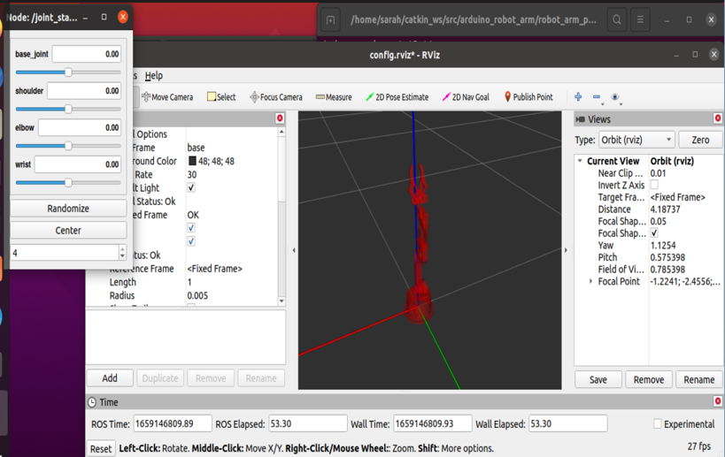

# Install RobotArm
Installation and run packages of the robotic arm on ROS-Noetic .

Get the packages from: https://github.com/smart-methods/arduino_robot_arm.git

Use the Moveit plugin to apply kinematics by the KDL solver and Gazebo, the simulation tool, to test it.

# To install and run the packages:

**Open Ubuntu > Terminal**

At first, create sub-directories:
```
 mkdir -p ~/catkin_ws/src
 cd ~/catkin_ws/
 catkin_make
```

Then get a copy of these packages using `clone`:
```
git clone https://github.com/smart-methods/arduino_robot_arm.git
```

Now, install all the Dependencies :
```
 rosdep install --from-paths src --ignore-src -r -y
 sudo apt-get install ros-noetic-moveit
 sudo apt-get install ros-noetic-joint-state-publisher ros-noetic-joint-state-publisher-gui
 sudo apt-get install ros-noetic-gazebo-ros-control joint-state-publisher
 sudo apt-get install ros-noetic-ros-controllers ros-noetic-ros-control
```

Finally, run the Rviz

```
source ~/catkin_ws/devel/setup.bash
roslaunch robot_arm_pkg check_motors.launch
```




